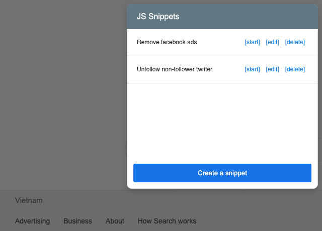

# JSSnippet (Chrome extension)

An unofficial Chrome extension to create, execute custom javascript tasks.



## What is a task?

A JS Snippet task is a javascript code block, is used to complete a task. For example, you can write a javascript code to unfollow people on Twitter. Everytime you run the task, it will execute your javascript snippet, which will search and unfollow people.

## How to write a task?

You can write a task as how you write to the browser console. Your task code is wrapped within a code block:

```js
(function (jsSnippet) {
   // Your task code here
});
```

The `jsSnippet` variable in the code block has 3 functions:

1. **setLabelinnerHTML(labelinnerHTML: string)**

    1.a. It is used to set the current task label, take an argument as an innerHTML. 

    1.b. When you need to add a button, simple add `<button data-action="alert" data-value="Hello World">Alert</button>` to string. All `button` elements will automatically triggle `onEventEmit` event below (section 2).

2. **onEventEmit(eventListener: Function)**

    2.a. It is used to listen to all `button` elements in the current task label (section 1.b). Every time a button is clicked, it trigger the `eventListener` callback function. The argument received is the button's dataset.

    2.b. To continue the example on section 1.b, when the button click, the data passed through `eventListener` will be:

```js
jsSnippet.onEventEmit(function(data) {
    // data => { action: "alert", value: "Hello World" }
    if (data.action === "alert") {
        alert(data.value);
    }
})
```

3. **completeTask()**

    3.a It is used to flag the task has completely executed, either failed or successfully

## Example of a task

```js
(function (jsSnippet) {

    // Update task label
    jsSnippet.setLabelinnerHTML(
        `<span>Task is running</span>
        <button data-action="alert" data-value="Hello World">[Alert]</button>
        <button data-action="stop">[Stop]</button>`
    );

    jsSnippet.onEventEmit(function(data) {
        switch (data.action) {
            case "alert":
                alert(data.value);
                break;
            case "stop":
                jsSnippet.completeTask();
                break;
        }
    });

    // You can access to the webpage element as usual
    // For example
    // document.body => webpage body element
    // window => webpage window
})
```

## How to install jsSnippet?

To install JSSnippet to your browser, navigate to [jsSnippet-chrome-extension Releases](https://github.com/hieunc229/jsSnippet-chrome-extension/releases) page. 

With the latest release:
1. Download `jsSnippet.crx`, or the attached `Source code` and unzip (if you want the `readme.md` file)
2. Either double click on jsSnippet.crx, or drag the file and drop into Chrome to complete installation.

## Examples

You can find the examples task from the [examples branch](https://github.com/hieunc229/jsSnippet-chrome-extension/tree/examples). Available examples:
- [Twitter - unfollow non-follower](https://github.com/hieunc229/jsSnippet-chrome-extension/tree/examples#twitter---unfollow-non-follower) 
- [Facebook - remove facebook ads](https://github.com/hieunc229/jsSnippet-chrome-extension/tree/examples#facebook---remove-facebook-ads)

## Feedback and support

Feel free to file an issue for feedback, or bug report